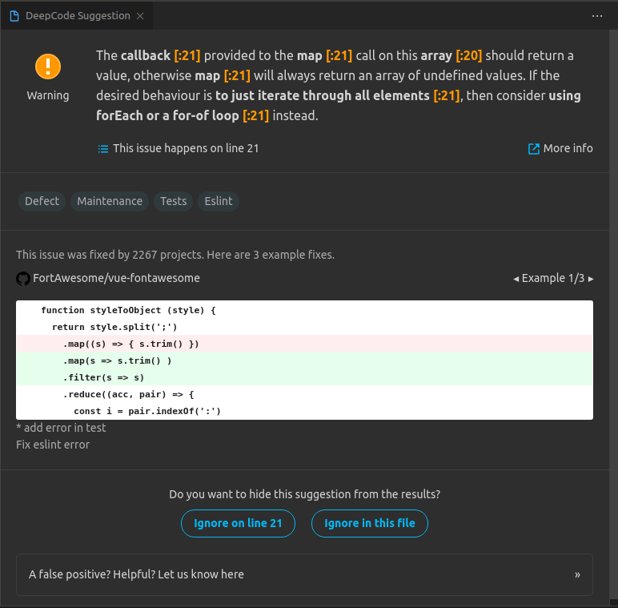

# Demo of how use DeepCode.ai

[DeepCode.ai](https://www.deepcode.ai/) is a real-time semantic code analysis - powered by AI.

## Supported languages
- Javascript
- Typescript
- Python
- Java
- PHP
- C
- C#
- C++ (Beta)

## Steps analyze code in web

- Sign in with Github in [deepcode.ai](https://www.deepcode.ai/cloud-login)

- Add the repositories to be analyzed

## Steps analyze code in vscode

- Download Extension [DeepCode](https://marketplace.visualstudio.com/items?itemName=DeepCode.deepcode)

Example: This may produce an error if listNumbers is undefined.

```js
const showPrimeFactors = (listNumbers) => {
  listNumbers.map((number) => {
    console.log(primeFactors(number));
  })
}
```

Suggestion by DeepCode



Solution: Change map by for-of

```js
const showPrimeFactors = (listNumbers) => {
  for (const number of listNumbers) {
    console.log(primeFactors(number));
  }
}
```

## Resources
- https://medium.com/deepcode-ai/deepcodes-ai-code-review-vs-other-static-analysis-tools-fda95ee51e6b

- https://www.deepcode.ai/blog/deepcode-adds-ai-based-static-code-analysis-support-for-c-and-c


